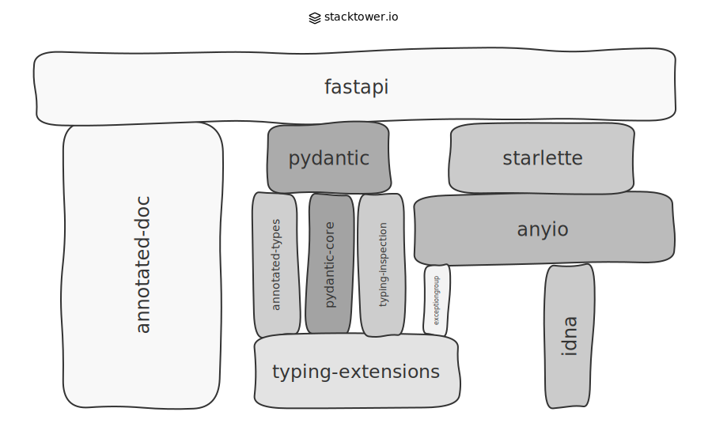

# Stacktower

[](https://github.com/matzehuels/stacktower/actions/workflows/ci.yml)
[](https://codecov.io/gh/matzehuels/stacktower)
[](https://goreportcard.com/report/github.com/matzehuels/stacktower)
[](https://pkg.go.dev/github.com/matzehuels/stacktower)
[](https://github.com/matzehuels/stacktower/releases)
[](https://opensource.org/licenses/Apache-2.0)

Inspired by [XKCD #2347](https://xkcd.com/2347/), Stacktower renders dependency graphs as **physical towers** where blocks rest on what they depend on. Your application sits at the top, supported by libraries below—all the way down to that one critical package maintained by *some dude in Nebraska*.

<p align="center">
  
</p>

📖 **[Read the full story at stacktower.io](https://www.stacktower.io)**

> ⚠️ **Note:** The ordering algorithms are still experimental and may not produce nicely stacked towers for projects with a large number of dependencies. Results can vary. We're actively working on improvements.

## Installation

### Homebrew (macOS/Linux)

```bash
brew install matzehuels/tap/stacktower
```

### Go

```bash
go install github.com/matzehuels/stacktower@latest
```

### From Source

```bash
git clone https://github.com/matzehuels/stacktower.git
cd stacktower
go build -o stacktower .
```

## Quick Start

```bash
# Render the included Flask example (XKCD-style tower is the default)
stacktower render examples/real/flask.json -o flask.svg
```

## Usage

Stacktower works in two stages: **parse** dependency data from package registries or manifest files, then **render** visualizations.

### Parsing Dependencies

The `parse` command auto-detects whether you're providing a package name or a manifest file:

```bash
stacktower parse <language> <package-or-file> [flags]
```

**Supported languages:** `python`, `rust`, `javascript`, `ruby`, `php`, `java`, `go`

#### From Package Registries

```bash
stacktower parse python fastapi -o fastapi.json                  # PyPI
stacktower parse rust serde -o serde.json                        # crates.io
stacktower parse javascript yargs -o yargs.json                  # npm
stacktower parse ruby rails -o rails.json                        # RubyGems
stacktower parse php monolog/monolog -o monolog.json             # Packagist
stacktower parse java com.google.guava:guava -o guava.json       # Maven Central
stacktower parse go github.com/gin-gonic/gin -o gin.json         # Go Module Proxy
```

#### From Manifest Files (Auto-Detected)

```bash
stacktower parse python examples/manifest/poetry.lock -o deps.json
stacktower parse python examples/manifest/requirements.txt -o deps.json
stacktower parse rust examples/manifest/Cargo.toml -o deps.json
stacktower parse javascript examples/manifest/package.json -o deps.json
stacktower parse ruby examples/manifest/Gemfile -o deps.json
stacktower parse php examples/manifest/composer.json -o deps.json
stacktower parse java examples/manifest/pom.xml -o deps.json
stacktower parse go examples/manifest/go.mod -o deps.json
```

When the argument exists on disk or matches a known manifest filename, Stacktower automatically parses it as a manifest.

The project name (root node) is auto-detected from the manifest or a sibling file:
- **Cargo.toml**: `[package].name`
- **go.mod**: `module` directive
- **package.json**: `name` field
- **composer.json**: `name` field
- **pom.xml**: `groupId:artifactId`
- **poetry.lock / requirements.txt**: `pyproject.toml` (sibling)
- **Gemfile**: `*.gemspec` (sibling)

Use `--name` to override the auto-detected name:

```bash
stacktower parse python requirements.txt --name="my-project" -o deps.json
stacktower parse ruby Gemfile -n my-rails-app -o deps.json
```

#### Explicit Mode

Force registry or manifest parsing when auto-detection isn't enough:

```bash
# Force registry lookup
stacktower parse python registry pypi fastapi
stacktower parse java registry maven org.springframework:spring-core
stacktower parse go registry goproxy github.com/spf13/cobra

# Force manifest type
stacktower parse python manifest poetry examples/manifest/poetry.lock
stacktower parse python manifest requirements examples/manifest/requirements.txt
stacktower parse rust manifest cargo examples/manifest/Cargo.toml
stacktower parse javascript manifest package examples/manifest/package.json
stacktower parse ruby manifest gemfile examples/manifest/Gemfile
stacktower parse php manifest composer examples/manifest/composer.json
stacktower parse java manifest pom examples/manifest/pom.xml
stacktower parse go manifest gomod examples/manifest/go.mod
```

#### Metadata Enrichment

By default, Stacktower enriches packages with GitHub metadata (stars, maintainers, last commit) for richer visualizations. Set `GITHUB_TOKEN` to enable this:

```bash
export GITHUB_TOKEN=your_token
stacktower parse python fastapi -o fastapi.json

# Disable enrichment if you don't have a token
stacktower parse python fastapi --enrich=false -o fastapi.json
```

### Rendering

The `render` command generates visualizations from parsed JSON graphs:

```bash
stacktower render <file> [flags]
```

#### Visualization Types

```bash
# Hand-drawn XKCD-style tower (default)
stacktower render examples/real/flask.json -o flask.svg

# Disable hand-drawn effects for a cleaner look
stacktower render examples/real/serde.json --style simple --randomize=false --popups=false -o serde.svg

# Traditional node-link diagram (uses Graphviz DOT)
stacktower render examples/real/yargs.json -t nodelink -o yargs.svg

# Multiple types at once (outputs flask_tower.svg, flask_nodelink.svg)
stacktower render examples/real/flask.json -t tower,nodelink -o flask
```

#### Output Formats

```bash
# SVG output (default)
stacktower render examples/real/flask.json -o flask.svg

# JSON layout export (for external tools or re-rendering)
stacktower render examples/real/flask.json -f json -o flask.json

# PDF output
stacktower render examples/real/flask.json -f pdf -o flask.pdf

# PNG output (2x scale by default)
stacktower render examples/real/flask.json -f png -o flask.png

# Multiple formats at once (outputs flask.svg, flask.json, flask.pdf)
stacktower render examples/real/flask.json -f svg,json,pdf -o flask

# Combine multiple types and formats
stacktower render examples/real/flask.json -t tower,nodelink -f svg,json
```

Output path behavior:
- **No `-o`**: Derives from input (`input.json` → `input.<format>`)
- **Single format**: Uses exact path (`-o out.svg` → `out.svg`)
- **Multiple formats**: Strips extension, adds format (`-o out.svg -f svg,json` → `out.svg`, `out.json`)
- **Multiple types**: Adds type suffix (`-t tower,nodelink` → `out_tower.svg`, `out_nodelink.svg`)

> **Note:** PDF and PNG output requires [librsvg](https://wiki.gnome.org/Projects/LibRsvg):
> - macOS: `brew install librsvg`
> - Linux: `apt install librsvg2-bin`

### Included Examples

The repository ships with pre-parsed graphs so you can experiment immediately:

```bash
# Real packages with full metadata (XKCD-style by default)
stacktower render examples/real/flask.json -o flask.svg
stacktower render examples/real/serde.json -o serde.svg
stacktower render examples/real/yargs.json -o yargs.svg

# With Nebraska guy ranking
stacktower render examples/real/flask.json --nebraska -o flask.svg

# Synthetic test cases
stacktower render examples/test/diamond.json -o diamond.svg
```

## Options Reference

### Global Options

| Flag | Description |
|------|-------------|
| `-v`, `--verbose` | Enable debug logging (search space info, timing details) |

### Parse Options

| Flag | Description |
|------|-------------|
| `-o`, `--output` | Output file (stdout if empty) |
| `-n`, `--name` | Project name for manifest parsing (auto-detected from manifest if not set) |
| `--max-depth N` | Maximum dependency depth (default: 10) |
| `--max-nodes N` | Maximum packages to fetch (default: 5000) |
| `--enrich` | Enrich with GitHub metadata (default: true, requires `GITHUB_TOKEN`) |
| `--refresh` | Bypass cache |

### Render Options

| Flag | Description |
|------|-------------|
| `-o`, `--output` | Output file or base path for multiple types/formats |
| `-t`, `--type` | Visualization type(s): `tower` (default), `nodelink` (comma-separated) |
| `-f`, `--format` | Output format(s): `svg` (default), `json`, `pdf`, `png` (comma-separated) |
| `--normalize` | Apply graph normalization: break cycles, remove transitive edges, assign layers, subdivide long edges (default: true) |

#### Tower Options

| Flag | Description |
|------|-------------|
| `--width N` | Frame width in pixels (default: 800) |
| `--height N` | Frame height in pixels (default: 600) |
| `--style handdrawn\|simple` | Visual style (default: handdrawn) |
| `--randomize` | Vary block widths to visualize load-bearing structure (default: true) |
| `--merge` | Merge subdivider blocks into continuous towers (default: true) |
| `--popups` | Enable hover popups with package metadata (default: true) |
| `--nebraska` | Show "Nebraska guy" maintainer ranking panel |
| `--edges` | Show dependency edges as dashed lines |
| `--ordering optimal\|barycentric` | Crossing minimization algorithm (default: optimal) |
| `--ordering-timeout N` | Timeout for optimal search in seconds (default: 60) |
| `--top-down` | Width flows from roots down; by default width flows from sinks up |

#### Node-Link Options

| Flag | Description |
|------|-------------|
| `--detailed` | Show all node metadata in labels |

## JSON Format

The render layer accepts a simple JSON format, making it easy to visualize **any** directed graph—not just package dependencies. You can hand-craft graphs for component diagrams, callgraphs, or pipe output from other tools.

### Minimal Example

```json
{
  "nodes": [
    { "id": "app" },
    { "id": "lib-a" },
    { "id": "lib-b" }
  ],
  "edges": [
    { "from": "app", "to": "lib-a" },
    { "from": "lib-a", "to": "lib-b" }
  ]
}
```

### Required Fields

| Field | Type | Description |
|-------|------|-------------|
| `nodes[].id` | string | Unique node identifier (displayed as label) |
| `edges[].from` | string | Source node ID |
| `edges[].to` | string | Target node ID |

### Optional Fields

| Field | Type | Description |
|-------|------|-------------|
| `nodes[].row` | int | Pre-assigned layer (computed automatically if omitted) |
| `nodes[].kind` | string | Internal use: `"subdivider"` or `"auxiliary"` |
| `nodes[].meta` | object | Freeform metadata for display features |

### Recognized `meta` Keys

These keys are read by specific render flags. All are optional—missing keys simply disable the corresponding feature.

| Key | Type | Used By |
|-----|------|---------|
| `repo_url` | string | Clickable blocks, `--popups`, `--nebraska` |
| `repo_stars` | int | `--popups` |
| `repo_owner` | string | `--nebraska` |
| `repo_maintainers` | []string | `--nebraska` |
| `repo_last_commit` | string (date) | `--popups`, brittle detection |
| `repo_last_release` | string (date) | `--popups` |
| `repo_archived` | bool | `--popups`, brittle detection |
| `summary` | string | `--popups` (fallback: `description`) |

The `--detailed` flag (node-link only) displays **all** meta keys in the node label.

## How It Works

1. **Parse** — Fetch package metadata from registries or local manifest files
2. **Reduce** — Remove transitive edges to show only direct dependencies
3. **Layer** — Assign each package to a row based on its depth
4. **Order** — Minimize edge crossings using branch-and-bound with PQ-tree pruning
5. **Layout** — Compute block widths proportional to downstream dependents
6. **Render** — Generate output in SVG, JSON, PDF, or PNG format

The ordering step is where the magic happens. Stacktower uses an optimal search algorithm that guarantees minimum crossings for small-to-medium graphs. For larger graphs, it gracefully falls back after a configurable timeout.

## Environment Variables

| Variable | Description |
|----------|-------------|
| `GITHUB_TOKEN` | GitHub API token for `--enrich` metadata |
| `GITLAB_TOKEN` | GitLab API token for `--enrich` metadata |

## Caching

HTTP responses are cached in `~/.cache/stacktower/` with a 24-hour TTL. Use `--refresh` to bypass the cache for a single request.

```bash
# Clear the entire cache
stacktower cache clear

# Show cache directory path
stacktower cache path
```

## Using as a Library

Stacktower can be used as a Go library for programmatic graph visualization.

```go
import (
    "github.com/matzehuels/stacktower/pkg/dag"
    "github.com/matzehuels/stacktower/pkg/dag/transform"
    "github.com/matzehuels/stacktower/pkg/render/tower/layout"
    "github.com/matzehuels/stacktower/pkg/render/tower/sink"
)

// Build a graph
g := dag.New(nil)
g.AddNode(dag.Node{ID: "app", Row: 0})
g.AddNode(dag.Node{ID: "lib", Row: 1})
g.AddEdge(dag.Edge{From: "app", To: "lib"})

// Normalize and render
transform.Normalize(g)
l := layout.Build(g, 800, 600)
svg := sink.RenderSVG(l, sink.WithGraph(g), sink.WithPopups())
```

📚 **[Full API documentation on pkg.go.dev](https://pkg.go.dev/github.com/matzehuels/stacktower)**

Key packages:
- [`pkg/dag`](https://pkg.go.dev/github.com/matzehuels/stacktower/pkg/dag) — DAG data structure and crossing algorithms
- [`pkg/dag/transform`](https://pkg.go.dev/github.com/matzehuels/stacktower/pkg/dag/transform) — Graph normalization pipeline
- [`pkg/render/tower`](https://pkg.go.dev/github.com/matzehuels/stacktower/pkg/render/tower) — Layout, ordering, and rendering
- [`pkg/deps`](https://pkg.go.dev/github.com/matzehuels/stacktower/pkg/deps) — Dependency resolution from registries

## Contributing

See [CONTRIBUTING.md](CONTRIBUTING.md) for guidelines on adding new languages, manifest parsers, or output formats.

## Development

```bash
make install-tools  # Install required tools (golangci-lint, goimports, govulncheck)
make check          # Run all CI checks locally (fmt, lint, test, vuln)
make build          # Build binary to bin/stacktower
```

| Command | Description |
|---------|-------------|
| `make check` | Format, lint, test, vulncheck (same as CI) |
| `make fmt` | Format code with gofmt and goimports |
| `make lint` | Run golangci-lint |
| `make test` | Run tests with race detector |
| `make cover` | Run tests with coverage report |
| `make vuln` | Check for known vulnerabilities |
| `make e2e` | Run end-to-end tests |
| `make snapshot` | Build release locally (no publish) |

Commit messages follow [Conventional Commits](https://www.conventionalcommits.org/).

## Learn More

- 📖 **[stacktower.io](https://www.stacktower.io)** — Interactive examples and the full story behind tower visualizations
- 🐛 **[Issues](https://github.com/matzehuels/stacktower/issues)** — Bug reports and feature requests

## License

Apache-2.0
